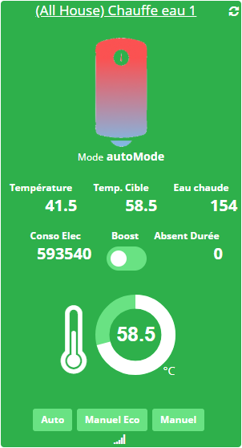
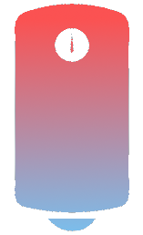
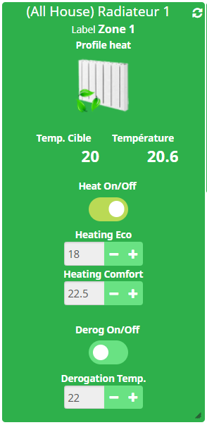
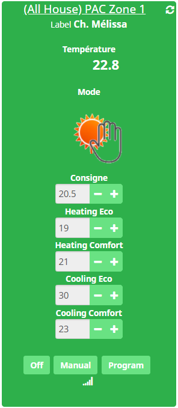

Plugin permettant de piloter les radiateurs Cozytouch à travers le
bridge Cozytouch

Mise à jour 1.0 vers 2.0
========================

> **Important**
>
> Le plugin dans sa version 1.0 ne gérait que des radiateurs
Atlantic connectés directement sur le bridge Cozytouch. Afin de pouvoir
gérer d’autres équipements le plugin a été complètement réécrit. Aussi,
lors de la mise à jour 1.0 vers 2.0, tous les équipements déjà
configurés seront supprimés. Si cette suppression n’a pas fonctionné, il
faut impérativement utiliser le bouton **Reset** pour supprimer la
configuration existante. Vous devrez ensuite resynchroniser dans la page
de configuration pour recréer l’ensemble des équipements. Cela implique
bien évidemment de revoir les scénarios ou les virtels ou autres
éléments qui ferait référence aux anciens équipements.

Configuration du plugin
=======================

Page de configuration
---------------------

Une fois le plugin installé, il vous faut renseigner vos informations de
connexion Cozytouch :

-   **Nom d’utilisateur** : nom d’utilisateur de votre compte Cozytouch

-   **Mot de passe** : mot de passe de votre compte Cozytouch

-   **Synchroniser** : permet de synchroniser Jeedom avec votre compte
    Cozytouch pour découvrir automatiquement les pièces où sont vos
    radiateur Cozytouch. A faire après avoir sauvegardé les
    paramètres précedents.

-   **Reset** : permet de supprimer l’ensemble des équipements
    dans jeedom. (Cela ne supprime pas les équipements au niveai
    de Cozytouch)

Récupération des informations de connexion
------------------------------------------

Les équipements Cozytouch ne sont pas pilotables directement. En effet,
le protocole permettant d’envoyer directement des commandes aux
equipements est le IO Home Control (protocole fermé). Toutefois,
Cozytouch offre la possibilité de passer par un bridge pour pouvoir
contrôler ces equipements. Une application sur smartphone a été
développée. Celle-ci envoie les commandes à  un serveur Cozytouch.
Ensuite, le bridge va requàªter ce serveur Cozytouch pour connaitre les
commandes qu’il doit envoyer aux equipements.

Pour intégrer vos equipements dans jeedom, vous devez posséder le bridge
Cozytouch et un compte créé à  travers l’application sur smartphone.
Ensuite, avec l’application Cozytouch sur smartphone, vous devez avoir
créé l’ensemble de vos equipements et les avoir associés au bridge

Une fois ces identifiants créés, il ne vous reste plus qu'à  les
renseigner dans la configuration du plugin et à  cliquer sur
synchroniser. Jeedom va alors créer tous vos équipements précédemment
créés dans l’application sur smartphone.

Configuration des équipements
=============================

La configuration des équipements Cozytouch est accessible à  partir du
menu Plugins :

Voilà  à  quoi ressemble la page du plugin Cozytouch (ici avec déjà  1
équipement) :

> **Tip**
>
> Comme à  beaucoup d’endroits sur Jeedom, placer la souris tout à 
> gauche permet de faire apparaitre un menu d’accès rapide (vous pouvez
> à  partir de votre profil le laisser toujours visible).

> **Note**
>
> Jeedom va générer un équipement par pièce initialement créée dans
> l’application Cozytouch sur smartphone.

Une fois que vous cliquez sur un équipement vous obtenez :

Equipement compatible
=====================

> **Important**
>
> Important, tous les équipements ne sont pas gérés par le plugin.

> **Warning**
>
> La connectivité entre le bridge Cozytouch et certain équipement est
> parfois capricieuse. La conectivité est affiché sur les widgets :

Equipement non connecté :

Equipement connecté :

Voici les types d'équipement gérés par le plugin et leur représentation
dans le dashboard :

-   **Radiateur Atlantic connecté directement sur le bridge Cozytouch**
    :

> **Warning**
>
> Les modes de chauffage (hors-gel, eco, confort, …) pour ces radiateurs
> ne doivent être utilisé que dans le cas où le radiateur est sur une
> programmation ***external*** sans programmateur externe (thermostat
> programmable type delta dore ou autre). En effet, pour les autres
> programmations (basic, interne, auto, …), ces commandes n’ont aucun
> effet. Un radiateur configuré sur ***external*** étant branché (au
> niveau du fil pilote) sur un programmateur externe, l’usage des
> commandes (hors-gel, eco, …) va déconnecter le radiateur de son
> programmateur externe et les ordres envoyé par ce dernier ne seront
> plus pris en compte.

-   **Radiateur connecté grâce à l’interface Cozytouch** :

-   **VMC Atlantic connecté directement sur le bridge Cozytouch** :

-   **Ballon d’eau chaude Atlantic connecté directement sur le bridge
    Cozytouch** :

    - Atlantic thermodynamique Odyssee
    - Atlantic Aquacosy 200 AV
    - Thermor Malicio 2
    - Atlantic Aeromax 4

> **Note**
>
> Plus le ballon devient bleu, moins il reste d’eau chaude:

>**Warning**
>
> Le pilotage du boost de certains modèles de ballon d’eau chaude est parfois problématique. (Elle l’ai déjà avec l’application Cozytouch sur les smartphones).

-   **Pompe à chaleur** :

> **Note**
>
> La pompe à chaleur peut être associée à un ballon d'eau chaude et un système de chauffage

>**Warning**
>
> Le mode boost du ballon d'eau de chaude est limité dans le temps.

>**Warning**
>
> Le mode dérogation du chauffage est appliqué pour une durée de 4h.

-   **PAC zone control** :

    - Pac clim zone control 2.0

- **Autres** :

    - Seche serviette Sensium de la marque Atlantic
    - Chaudière Naia2 atlantic

FAQ
===
à compléter

Changelog
========= 
Version : 2.2.0 - 03/10/2021
---------------
-   Nouvelle Gestion de l'authentification (Nécessite que la mise à jour du compte ait été faite dans l'application mobile Cozytouch)

Version : 2.1.0 - 24/04/2020
---------------
-   Compatibilité jeedom V4 : migration des widgets.

-   Gestion de nouveaux équipements

    -   Atlantic : Seche Serviette Sensium

Version : 2.0.3
---------------

-   Gestion de nouveaux équipements

    -   Zone Control Odysee Pi

Version : 2.0.2
---------------

-   Gestion de nouveaux équipements

    -   Zone Control Odysee Pi

Version : 2.0.1
---------------

-   Gestion de nouveaux équipements

    -   Pompe à chaleur
    
Version : 2.0.0
---------------

-   Gestion de nouveaux équipements

    -   Ballon d’eau chaude atlantic

    -   VMC atlantic

    -   Interface cozytouch

Version : 1.0.2
---------------

-   Mise à jour : documentation

Version : 1.0.1
---------------

-   Correction bug sur la synchronisation

Version : 1.0.0
---------------

-   Gestion des radiateur connecté Atlantic

